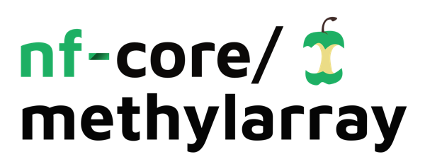

<h1>
  <picture>
    <source media="(prefers-color-scheme: dark)" srcset="docs/images/nf-core-methylarray_logo_dark.png">
    
  </picture>
</h1>

[](https://github.com/codespaces/new/nf-core/methylarray)
[](https://github.com/nf-core/methylarray/actions/workflows/nf-test.yml)
[](https://github.com/nf-core/methylarray/actions/workflows/linting.yml)[](https://nf-co.re/methylarray/results)[](https://doi.org/10.5281/zenodo.XXXXXXX)
[](https://www.nf-test.com)

[](https://www.nextflow.io/)
[](https://github.com/nf-core/tools/releases/tag/3.5.2)
[](https://docs.conda.io/en/latest/)
[](https://www.docker.com/)
[](https://sylabs.io/docs/)
[](https://cloud.seqera.io/launch?pipeline=https://github.com/nf-core/methylarray)

[](https://nfcore.slack.com/channels/methylarray)[](https://bsky.app/profile/nf-co.re)[](https://mstdn.science/@nf_core)[](https://www.youtube.com/c/nf-core)

## Introduction

**nf-core/methylarray** is a bioinformatics pipeline for comprehensive analysis of Illumina EPICv2 DNA methylation arrays. It performs quality control, normalization, filtering, cell composition estimation, and differential methylation analysis (DMP and DMR) on IDAT files.

The pipeline takes as input a sample sheet (TSV), a directory of raw IDAT files, and an optional metadata CSV with clinical or phenotype information. It produces QC reports, normalized beta-value matrices, and results from differential methylation position (DMP) and differential methylation region (DMR) analyses.

Pipeline steps:

1. **Import IDAT** — Load raw IDAT files into an RGChannelSet object using minfi
2. **Raw intensity QC** — Assess raw fluorescence intensities and flag low-quality samples
3. **SeSAMe normalization + pOOBAH QC** — Apply SeSAMe preprocessing pipeline (QCDPB) with pOOBAH masking of failed probes; produce normalized beta values
4. **Control probe QC report** — Generate per-sample strip plots for Illumina internal control probe categories (staining, hybridization, bisulfite conversion, etc.)
5. **SNP heatmap** — Cluster samples by genotype SNP probes to detect sample swaps or unexpected duplicates
6. **Density plots** — Visualize beta-value density distributions before and after SeSAMe normalization
7. **Sex QC** — Predict biological sex from X/Y chromosome methylation intensities and compare to reported sex
8. **Probe filtering** — Sequentially remove sex-chromosome probes, non-CpG probes, and probes with insufficient bead counts
9. **Cell composition estimation** — Estimate blood cell-type proportions using FlowSorted.Blood.EPIC (Houseman deconvolution)
10. **Split / collapse** — Separate beta matrices for DMP and DMR analysis; collapse EPICv2 positional replicates
11. **Final exports** — Export final beta-value (bVals) and M-value (mVals) matrices along with probe and sample manifests
12. **Metadata alignment** — Join methylation matrices with sample metadata, predicted sex, and cell composition estimates
13. **Covariate PCA** — Perform PCA and ChAMP SVD analysis to assess associations between principal components and sample covariates
14. **DMP analysis (limma)** — Run pairwise differential methylation position analysis using limma; optionally applies ComBat batch correction or includes plate as a model covariate
15. **DMR analysis (DMRcate)** — Run pairwise differential methylation region analysis using DMRcate on EPICv2-remapped probe coordinates

## Usage

> [!NOTE]
> If you are new to Nextflow and nf-core, please refer to [this page](https://nf-co.re/docs/usage/installation) on how to set-up Nextflow. Make sure to [test your setup](https://nf-co.re/docs/usage/introduction#how-to-run-a-pipeline) with `-profile test` before running the workflow on actual data.

> [!IMPORTANT]
> This pipeline requires **Nextflow ≥ 25.04.0**. Please ensure your Nextflow installation is up to date before running.

First, prepare a samplesheet describing your samples. The file must be tab-separated (TSV) with a header row:

`samplesheet.tsv`:

```tsv
Sample_Name	Sentrix_ID	Sentrix_Position
SAMPLE_001	207842290093	R01C01
SAMPLE_002	207842290093	R01C02
```

Each row corresponds to one sample. `Sentrix_ID` and `Sentrix_Position` together identify the IDAT file pair (e.g. `207842290093_R01C01_Grn.idat` / `207842290093_R01C01_Red.idat`). The IDAT files themselves should be placed in a directory pointed to by `--idat_dir`.

Now, you can run the pipeline using:

```bash
nextflow run nf-core/methylarray \
   -profile <docker/singularity/.../institute> \
   --input samplesheet.tsv \
   --idat_dir /path/to/idat_files/ \
   --meta_file metadata.csv \
   --outdir <OUTDIR>
```

> [!WARNING]
> Please provide pipeline parameters via the CLI or Nextflow `-params-file` option. Custom config files including those provided by the `-c` Nextflow option can be used to provide any configuration _**except for parameters**_; see [docs](https://nf-co.re/docs/usage/getting_started/configuration#custom-configuration-files).

For more details and further functionality, please refer to the [usage documentation](https://nf-co.re/methylarray/usage) and the [parameter documentation](https://nf-co.re/methylarray/parameters).

## Pipeline output

To see the results of an example test run with a full size dataset refer to the [results](https://nf-co.re/methylarray/results) tab on the nf-core website pipeline page.
For more details about the output files and reports, please refer to the
[output documentation](https://nf-co.re/methylarray/output).

## Credits

nf-core/methylarray was originally written by Adam Schumacher / Ghada Nouairia.

We thank the following people for their extensive assistance in the development of this pipeline:

## Contributions and Support

If you would like to contribute to this pipeline, please see the [contributing guidelines](.github/CONTRIBUTING.md).

For further information or help, don't hesitate to get in touch on the [Slack `#methylarray` channel](https://nfcore.slack.com/channels/methylarray) (you can join with [this invite](https://nf-co.re/join/slack)).

## Citations

<!-- After first release: uncomment the line below and update the Zenodo DOI and badge at the top of this file. -->
<!-- If you use nf-core/methylarray for your analysis, please cite it using the following doi: [10.5281/zenodo.XXXXXX](https://doi.org/10.5281/zenodo.XXXXXX) -->

An extensive list of references for the tools used by the pipeline can be found in the [`CITATIONS.md`](CITATIONS.md) file.

You can cite the `nf-core` publication as follows:

> **The nf-core framework for community-curated bioinformatics pipelines.**
>
> Philip Ewels, Alexander Peltzer, Sven Fillinger, Harshil Patel, Johannes Alneberg, Andreas Wilm, Maxime Ulysse Garcia, Paolo Di Tommaso & Sven Nahnsen.
>
> _Nat Biotechnol._ 2020 Feb 13. doi: [10.1038/s41587-020-0439-x](https://dx.doi.org/10.1038/s41587-020-0439-x).
